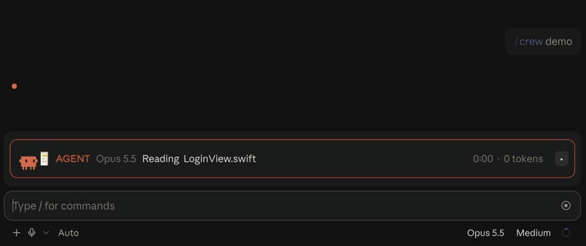
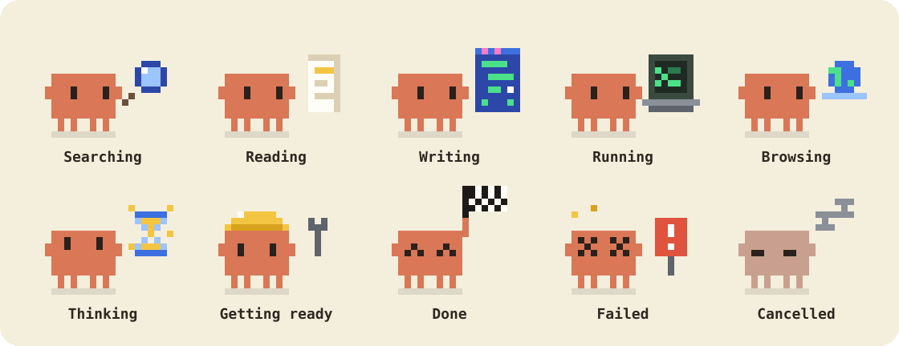

<h1 align="center">Agent Crew</h1>

<p align="center"><b>Your subagents, as a tiny pixel crew above the prompt.</b><br>
See who is doing what, how far along they are, and how long is left.</p>

<p align="center">
  
</p>

<p align="center">
  <a href="LICENSE"></a>
  
</p>

## Install

```
/plugin install agent-crew --marketplace bekir1184/agent-crew
```

That's it. The crew shows up by itself whenever Claude is at work. Want a look right now? Type `/crew demo`.

**Costs nothing.** Agent Crew never calls a model and never touches your prompts: it only watches.

## Claude, live

While Claude works, the framed line shows what it's doing this very second. When the turn ends it shrinks to one quiet line with the totals. Press the arrow to see what happened.


## The crew

When Claude hands work to subagents, they line up below, one row each. Each row names the model it runs on, so you can tell Opus from Haiku at a glance. Helpers started by a subagent tuck in under their parent. Too busy? The arrow on the title folds them away, and the – button shrinks the whole band to one plain line (it stays that way in later sessions until you press ▸). Cancelled agents leave the stage right away. The ⇥ button moves the whole crew into a narrow pane beside the conversation, one stacked card per agent; ⇤ (or closing the pane) brings it back.

Each critter holds the tool it's using:



## Thinking...

Thinking is where agents spend most of their time, so the critters keep it lively: an hourglass, a thought cloud with a question mark, a lightbulb that lights up. Each one at its own pace.


## It needs you

When an agent stops to ask for permission, it says so: a yellow question bubble, and the title tells you how many are waiting.


## The details

Every row has an arrow. It opens everything the row had no room for: the full task, its to-do list, the files it touched, and its tokens.


## How long is left?

No model is asked and no tokens are spent: Agent Crew simply remembers how long this kind of agent took before.


## Honest tokens

A row shows what the agent's own work took: what it read in and what it wrote. Nothing else.

Claude also keeps the whole conversation in a cache and re-reads it on every request. And after a break the cache expires, so the next request writes the whole conversation into it again, which on a long conversation can be hundreds of thousands of tokens at once. Neither is the agent's work, so neither inflates the row: both sit in the details panel, on their own line.

Turn on **Show estimated cost** in the settings and each row also gets a ≈ dollar figure.

## Commands

| | |
| --- | --- |
| `/crew` | Hide or show the crew |
| `/crew demo` | A 30-second show: Claude starts alone, the crew arrives, thinks, asks you, and ends with all flags up |
| `/crew clear` | Clear the stage |

**Settings** live in `/plugin configure agent-crew@agent-crew`: show Claude's own line (on), show estimated cost (off).

**In the terminal** there's no pixel art, just a colored dot per row. Press `ctrl+x tab` to reach the crew, then the letter on an arrow: `h` for the title, `z` to minimise, `y` to move to the side pane, `a`, `b`, `c` for the rows.

## Development

Run it from a clone, then check and test it (Claude Code 2.1.293 or newer):

```bash
claude --plugin-dir .
claude plugin validate .
claude plugin test .
```

The animated images in `docs/` and `site/` are drawn from the mod's own pixel art: `node scripts/docs.mjs` (Node 25+) redraws them.

---

<p align="center">Made for fun. <a href="LICENSE">MIT</a> © 2026 Bekir Ersever</p>
